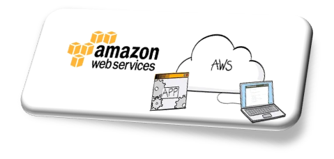
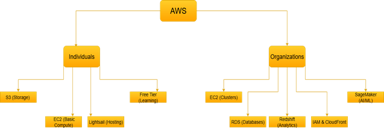

  
  

    

- [Overview](#overview)
- [How AWS works](#how-aws-works)
- [Key system requirements](#key-system-requirements)
- [Getting started](#getting-started)
	- [Sign up for AWS](#sign-up-for-aws)
	- [Access the AWS management console](#access-the-aws-management-console)
	- [Start your first project](#start-your-first-project)
		- [Launch an Amazon EC2 instance](#launch-an-amazon-ec2-instance)
		- [Create an Amazon S3 bucket](#create-an-amazon-s3-bucket)
		- [Enable your billing alerts](#enable-your-billing-alerts)
- [What’s next](#whats-next)
- [FAQs](#faqs)
- [Reference](#reference)
- [Glossary](#glossary)

# Overview

Amazon.com, Inc. owns and operates AWS (Amazon Web Services), a cloud computing platform. AWS offers more than 200 cloud services and ranks as the most widely used cloud platform. Organizations and individuals use AWS to run applications, store data, build websites, and explore new technologies. 

**Benefits of AWS**

AWS reduces costs because you pay only for what you use. You can scale applications up or down at any time. AWS secures systems and meets global compliance standards. Startups, enterprises, and governments trust AWS to support their workloads.

**Types of AWS services**

AWS provides a wide range of services for developers, IT teams, and businesses. It runs on a global infrastructure with regions and availability zones, and it includes tools that help you manage, monitor, and optimize costs. The following diagram shows examples of AWS services categorized for individuals and organizations:

 

**Limitations of AWS**

AWS offers many benefits, but it also has some limitations. The limitations are as follows:

* Complex for beginners: The wide range of services can be difficult to understand without training.
* Needs stable internet access: AWS services run in the cloud, so a reliable internet connection is required.
* Costs may increase: Expenses can grow quickly if you do not track usage and billing.

This guide explains what AWS is, how it works, what you need to get started, and the steps to take first. 

# How AWS works

AWS delivers cloud services through its global infrastructure. Users sign in, choose services, provision resources, and then manage, monitor, and scale them as needed. AWS also provides cost and performance reports to help users optimize their workloads. The following diagram explains how AWS works:

# Key system requirements

Before you start, you need the following requirements to use AWS:

* Internet access
* A supported web browser
  
# Getting started

The steps in this section guide you from signing up for an AWS account to setting up your first project in AWS.

## Sign up for AWS
Create an AWS account to access AWS services. The following steps help you sign up with a free support plan:

To sign up,

1.  On your browser, go to the [AWS sign-up page](https://aws.amazon.com/)
2.	Click **Create Account**.
3.	Enter your Root user email address and AWS account name.
4.	Click **Verify email address**.
5.	Enter the verification code that AWS sends to your email
6.	Click **Verify**.

	**Note:** If you do not receive the code, click **Resend code**.
7.	On Create your password page, enter and confirm your password.
8.	Click **Continue (step 1 of 5)**.

	**Result:** AWS displays the Sign-up page.
9.	On your Sign up for AWS page, click **Choose free plan**.
10.	Enter details for all required fields
11.	Select the check box to accept the AWS Customer Agreement.
12.	Click **Agree and Continue (step 2 of 5)**.
13.	Enter your billing information and click **Verify and Continue (step 3 of 5)**.
14.	Verify OTP on your bank page.

	**Note**: AWS sends the OTP to your registered phone number.

15.	Confirm your identity with the phone number and captcha.
16.	On your Select a support plan page, select **Basic support-Free**.
17.	Click **Complete sign up**.

**Result:** Your AWS account is ready with a support level.

## Access the AWS management console

The AWS Management Console is the main interface to access and manage AWS services. You use it to launch resources, configure settings, and monitor usage.

To access,

1.	Go to the [AWS Management Console](https://console.aws.amazon.com/).
2.	Click **Sign in using root user email**.
3.	Perform one of the following:
	* Select Root user:
		1.	Enter your root email ID.
		2.	Click **Next**.
    * Select IAM user:
		1.	Enter your 12-digit account ID or alias.
		2.	Click **Next**.
4.	Enter your password.
5.	Click **Sign in**.

**Result:** AWS displays the Management Console home page, where you can search for and open services such as Amazon EC2, Amazon S3, and Amazon RDS.

## Start your first project

A small free tier project helps you practice using AWS. This includes the three steps as following:

1.	Launch an Amazon EC2 instance.
2.	Create an Amazon S3 bucket.
3.	Enable your billing alerts.

These steps help you to successfully complete your first AWS project.

### Launch an Amazon EC2 instance

Amazon EC2 lets you run virtual servers in the cloud. This task shows you how to launch a Free Tier–eligible instance.

To launch,

1.	Sign in to the AWS Management Console.
2.	On the search bar, enter EC2.
3.	Open the EC2 Dashboard.
4.	On the Launch an instance section, Click **Launch instance**. 
5.	Enter a unique name for your instance.
6.	On the Application and OS Images (AMI) section, select a Free Tier–eligible AMI.
7.	On the Instance type section, select either t2.micro or t3.micro as the instance type.
8.	Click **Create key pair**. 
9.	Click **Download key pair**.

	**Note:** Save the downloaded file securely. You cannot download it next time.
10.	Configure network and storage.

	**Note:** You can leave the defaults. The Free Tier includes 30 GB of storage with a default root volume.
11.	Click **Review and Launch**.
12.	On your summary page, click **Launch instance**.

**Result:** AWS launches your new virtual server. It appears in the EC2 Dashboard as a running instance.

### Create an Amazon S3 bucket

Amazon S3 stores your data as objects in buckets. This task shows you how to create a Free Tier–eligible bucket.

To create,

1.	Sign in to the [AWS Management Console](https://console.aws.amazon.com/).
2.	On your search bar, enter **S3**.
3.	Open the S3 Dashboard.
4.	On the Buckets section, click **Create bucket**.
5.	Enter a unique bucket name.
6.	Select the AWS Region.

	**Note:** Select the region where you want to create the bucket.

7.	Configure the settings.

	**Note:** You can select the defaults for the configuration.
8.	Set permissions for the bucket.
9.	Click **Create bucket**.

**Result:** AWS creates a new S3 bucket that appears in the S3 Dashboard. You can upload and manage the objects in it.

### Enable your billing alerts

Billing alerts help you track your AWS usage costs. This task shows you how to enable billing alerts in the AWS Billing and Cost Management console.

To enable,

1.	Sign in to the [AWS Management Console](https://console.aws.amazon.com/).
2.	On your search bar, enter Billing.
3.	Open the Billing and Cost Management console.
4.	On the left navigation pane, select Billing preferences.
5.	On the Billing preferences page, select the check box for Receive Billing Alerts.
6.	Click **Save preferences**.

**Result:** AWS enables billing alerts for your account. You can now create and manage cost and usage alarms in Amazon CloudWatch.

# What’s next

Once you set up billing alerts, you can explore more AWS features to expand your skills.

Use these resources to continue learning:

* [Amazon CloudWatch](https://aws.amazon.com/cloudwatch/): Monitor your AWS resources and receive alarms when usage crosses limits.
* [AWS Lambda](https://aws.amazon.com/lambda/):  Run code without managing servers.
* [AWS Elastic Beanstalk](https://aws.amazon.com/elasticbeanstalk/): Deploy and scale web applications quickly.
* [AWS Training and Certification](https://aws.amazon.com/training/):  Take free courses and start preparing for AWS Certification.
  
  
# FAQs

Q1: What is the difference between EC2 and Lightsail?

A1: EC2 offers flexible, fully configurable virtual servers. Lightsail provides a simplified way to launch and manage virtual private servers with preset apps and pricing.

Q2: What is IAM?

A2: Identity & Access Management (IAM) is the AWS service that lets you securely control access to AWS resources.

Q3: How can I monitor my AWS costs?

A3: Enable billing alerts in the Billing and Cost Management console, then create cost and usage alarms in Amazon CloudWatch.

Q4: Do I need coding skills to use AWS?

A4: No. You can use the AWS Management Console, which provides a point-and-click interface. Coding is optional and mainly used for automation or advanced configurations.

Q5: How can I avoid unexpected costs in AWS?

A5: Enable billing alerts in the Billing and Cost Management console and create cost and usage alarms in Amazon CloudWatch. Regularly check your AWS billing dashboard and make sure you select Free Tier–eligible options when you launch resources.

# Reference

* [AWS website](https://aws.amazon.com/elasticbeanstalk/): General entry point for all AWS services, features, and documentation. 
* [Onboarding to AWS](https://aws.amazon.com/getting-started/onboarding-to-aws/?intClick=gsrc_navbar): Step-by-step guide to set up an AWS account and start using core services. 
* [AWS free tier](https://aws.amazon.com/free/?nc2=h_pr_ftr): Information on free usage tier available for 12 months with limited services.
* [AWS whitepaper](https://docs.aws.amazon.com/whitepapers/latest/aws-overview/introduction.html): Technical overview of AWS core services, global infrastructure, and benefits. 
* [AWS whitepaper](https://docs.aws.amazon.com/whitepapers/latest/aws-overview/next-steps.html): Detailed guide on learning paths and advanced AWS adoption.
* [AWS documentation](https://docs.aws.amazon.com/whitepapers/latest/aws-overview/next-steps.html): Official documentation and tutorials for all AWS services.
* [AWS training and certification](https://aws.amazon.com/training/): Learning and certification programs to develop AWS cloud skills. 
* [AWS architecture center](https://aws.amazon.com/architecture/): Design patterns, best practices, and reference architectures for AWS. 

# Glossary

  
📖 AWS Terms & Definitions (click to expand)

<table style="border: 5px solid orange; border-collapse: collapse; width: 100%;background-color:#FFFFFF;color:#000000;">
  <thead>
    <tr>
      <th style="border: 2px solid orange; padding: 6px; background-color:#FFFFFF
;">Term</th>
      <th style="border: 2px solid orange; padding: 6px; background-color:#FFFFFF
;">Definition</th>
    </tr>
  </thead>
  <tbody>
    <tr>
      <td style="border: 2px solid orange; padding: 6px;">AWS</td>
      <td style="border: 2px solid orange; padding: 6px;">Amazon Web Services. A cloud computing platform that provides on-demand infrastructure and application services.</td>
    </tr>
    <tr>
      <td style="border: 2px solid orange; padding: 6px;">EC2</td>
      <td style="border: 2px solid orange; padding: 6px;">Elastic Compute Cloud. A web service that lets you run virtual servers, called instances, in the AWS cloud.</td>
    </tr>
    <tr>
      <td style="border: 2px solid orange; padding: 6px;">S3</td>
      <td style="border: 2px solid orange; padding: 6px;">Simple Storage Service. A web service that stores and retrieves any amount of data as objects in buckets.</td>
    </tr>
    <tr>
      <td style="border: 2px solid orange; padding: 6px;">IAM</td>
      <td style="border: 2px solid orange; padding: 6px;">Identity &amp; Access Management. A service that lets you control access to AWS resources securely.</td>
    </tr>
    <tr>
      <td style="border: 2px solid orange; padding: 6px;">Lightsail</td>
      <td style="border: 2px solid orange; padding: 6px;">A simplified service that lets you quickly launch and manage virtual private servers with preconfigured apps.</td>
	   <tr>
      <td style="border: 2px solid orange; padding: 6px;">RDS</td>
      <td style="border: 2px solid orange; padding: 6px;">Relational Database Service. A managed service that makes it easy to set up, operate, and scale relational databases in AWS.</td>
    </tr>
    <tr>
      <td style="border: 2px solid orange; padding: 6px;">SageMaker</td>
      <td style="border: 2px solid orange; padding: 6px;">A fully managed service that lets you build, train, and deploy machine learning models at scale.</td>
    </tr>
    <tr>
      <td style="border: 2px solid orange; padding: 6px;">Free Tier</td>
      <td style="border: 2px solid orange; padding: 6px;">Limited AWS services that are available at no cost for 12 months after you sign up.</td>
    </tr>
    <tr>
      <td style="border: 2px solid orange; padding: 6px;">Root user email address</td>
      <td style="border: 2px solid orange; padding: 6px;">The email address you use to create and sign in to the AWS account as the root user.</td>
    </tr>
    <tr>
      <td style="border: 2px solid orange; padding: 6px;">OTP</td>
      <td style="border: 2px solid orange; padding: 6px;">One-Time Password. A temporary code that AWS sends to verify your identity.</td>
    </tr>
    <tr>
      <td style="border: 2px solid orange; padding: 6px;">AMI</td>
      <td style="border: 2px solid orange; padding: 6px;">Amazon Machine Image. A preconfigured template of an operating system and software you use to launch an EC2 instance.</td>
    </tr>
  </tbody>
</table>

